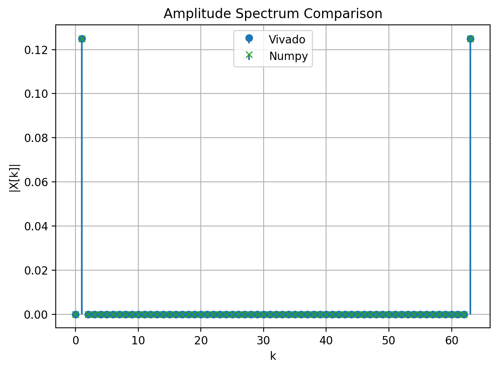

# Hardware Implementation and Optimization of a 64-Point FFT

[简体中文](README_zh-CN.md)

This repository implements and verifies a **64-point radix-2 decimation-in-time (DIT) FFT** in SystemVerilog. It starts with a fully parallel (“flash”) reference architecture, then folds the datapath into a streaming **single-delay feedback (SDF)** architecture based on the ideas in Keshab K. Parhi's VLSI DSP work.

The project is intended as a reproducible hardware-design case study: the RTL, Vivado project, fixed-point Python model, stimulus generators, plots, logs, and implementation reports are kept together so that an algorithm-level result can be traced to FPGA resources and timing.

## Highlights

- 64-point, radix-2, DIT FFT with six cascaded SDF stages.
- Streaming interface: one complex sample per cycle after the frame-start protocol and input buffering.
- Q1.15 input/output format with extra internal width and a consistent 1/64 normalization.
- Input bit-reversal buffer, twiddle-factor ROM, complex multiplier, butterfly add/subtract, and stage delay lines.
- Five synchronized stimulus modes: pulse, sine, square, deterministic random, and file input.
- Vivado XSim plus Python/NumPy verification with error statistics and magnitude/phase plots.
- Checked-in synthesis, implementation, power, timing, and example-output artifacts for inspection without rerunning Vivado.

## Architecture at a glance

```text
complex input stream
        │
        ▼
double-bank input reorder buffer (bit reversal)
        │
        ▼
SDF stage 0 (delay 1) → … → SDF stage 5 (delay 32)
        │
        ▼
Q1.15 FFT output stream + valid_out
```

For a frame of 64 samples, the six stages implement the radix-2 butterflies and twiddle rotations. The SDF schedule reuses arithmetic over time, trading frame latency for a much smaller hardware footprint than the fully parallel reference.

The implemented transform is:

```text
X[k] = (1/64) · Σ(n=0…63) x[n] · exp(-j·2π·k·n/64)
```

## Repository map

| Path | Purpose |
| --- | --- |
| [`fft64_sim/sim/fft64_model.sv`](fft64_sim/sim/fft64_model.sv) | Main SDF RTL used by the current testbench and Vivado simulation |
| [`fft64_sim/sim/tb_fft64.sv`](fft64_sim/sim/tb_fft64.sv) | Self-driven SDF testbench; writes `output_vivado.txt` |
| [`fft64_sim/sim/fft64_flash.sv`](fft64_sim/sim/fft64_flash.sv) | Fully parallel reference architecture |
| [`fft64_sim/sim/fft64_sdf.sv`](fft64_sim/sim/fft64_sdf.sv) | Standalone SDF source variant |
| [`fft64_sim/py/check_fft64.py`](fft64_sim/py/check_fft64.py) | NumPy reference, fixed-point conversion, error report, and plots |
| [`fft64_sim/scripts/run_sim.tcl`](fft64_sim/scripts/run_sim.tcl) | Vivado batch-simulation script |
| [`fft64_sim/run_fft64_all.py`](fft64_sim/run_fft64_all.py) | One-click Vivado + Python driver with timestamped log collection |
| [`fft64_sim/vivado_project/FFT64_SIM/FFT64_SIM.xpr`](fft64_sim/vivado_project/FFT64_SIM/FFT64_SIM.xpr) | Vivado project |
| [`fft64_sim/reports/`](fft64_sim/reports/) | Routed utilization and timing reports |
| [`fft64_sim/report.pdf`](fft64_sim/report.pdf) | Detailed project report |

The simulation directory has its own focused guide: [`fft64_sim/README.md`](fft64_sim/README.md).

## Quick start

### 1. Python-only reference check

Python-only checking expects a Vivado output file to already exist. It is useful for inspecting the reference model and regenerating plots:

```bash
cd fft64_sim
python py/check_fft64.py --input-mode 1 --no-show --save-dir plots
```

### 2. Run Vivado behavioral simulation

From `fft64_sim/` (the TCL script uses paths relative to this directory):

```bash
vivado -mode batch -source scripts/run_sim.tcl
```

The testbench writes 64 lines of signed `real imag` samples to `output_vivado.txt` in the XSim working directory. The exact location is also defined by `OUTPUT_FILE` in `py/check_fft64.py`.

### 3. Run the complete flow

```bash
cd fft64_sim
python run_fft64_all.py
```

The wrapper runs Vivado, archives new Vivado logs under `logs/vivado_run_<timestamp>/`, and then runs the NumPy comparison. The Windows Vivado path in `run_fft64_all.py` must be changed for other installations.

## Stimulus modes

The SystemVerilog testbench and Python checker use the same mode numbers and waveform parameters.

| `INPUT_MODE` | Stimulus | Use |
| ---: | --- | --- |
| 0 | `PULSE` | Impulse response / flat-spectrum sanity check |
| 1 | `SINE` | Default single-tone test; tone index is `WAVE_K` |
| 2 | `SQUARE` | Harmonic-content and non-sinusoidal test |
| 3 | `RANDOM` | Deterministic complex sequence from a shared LCG |
| 4 | `FROM_FILE` | 64 fixed-point pairs from [`fft64_sim/rt1/input.txt`](fft64_sim/rt1/input.txt) |

Keep `INPUT_MODE`, `WAVE_K`, data width, and amplitude settings aligned between [`tb_fft64.sv`](fft64_sim/sim/tb_fft64.sv) and [`check_fft64.py`](fft64_sim/py/check_fft64.py). The Python checker exposes `--input-mode`, `--save-dir`, `--prefix`, and `--no-show` for convenient batch use.

## Verification outputs

- `output_vivado.txt`: 64 Q1.15 complex FFT outputs from XSim.
- `plots/`: generated magnitude and phase overlays.
- `plots_example/`: committed examples for pulse, sine, square, and random stimuli.
- `logs/`: timestamped Vivado logs collected by the wrapper script.

The checker reports maximum and average absolute error, prints point-by-point comparisons, and masks numerical noise near zero before phase inspection. A representative plot is included below.



## FPGA results

The following figures are taken from the checked-in Vivado reports for the same Virtex-7 device family (`7vx690tffg1761-2`). The flash design is the fully parallel reference; the SDF design is the folded implementation.

| Metric | Flash reference | SDF implementation | Reduction |
| --- | ---: | ---: | ---: |
| Slice LUTs | 12,289 | 2,158 | 82.4% |
| Slice registers | 15,496 | 4,830 | 68.8% |
| DSP48E1 | 768 | 24 | 96.9% |
| Bonded IOB | 4,100 | 68 | 98.3% |

The routed SDF report records **1.631 ns setup slack** at a **100 MHz (10 ns) clock**, with no setup or hold violations. See [`impl_1_util.rpt`](fft64_sim/reports/impl_1_util.rpt), [`impl_1_timing.rpt`](fft64_sim/reports/impl_1_timing.rpt), and [`fft64_dit_sdf_timing_summary_routed.rpt`](fft64_sim/vivado_project/FFT64_SIM/FFT64_SIM.runs/impl_1/fft64_dit_sdf_timing_summary_routed.rpt) for the source reports.

These numbers describe the checked-in build, not a universal guarantee: device, Vivado version, constraints, synthesis options, and I/O assignments all affect the result.

## Design notes and limitations

- The current XDC creates a 10 ns clock but does not specify external input/output delays. The reported slack is therefore an internal clock-to-clock result.
- The implementation reports contain Vivado-generated warnings about default I/O standards and missing pin locations. Add board-specific XDC constraints before generating a bitstream.
- `run_fft64_all.py` currently contains a Windows-specific Vivado executable path (`C:\\Xilinx\\Vivado\\2018.3\\bin\\vivado.bat`). Update `VIVADO_EXE` or call the TCL/Python steps separately on another machine.
- Generated Vivado/XSim artifacts are intentionally retained for auditability; a clean rebuild can produce additional files under `vivado_project/` and `logs/`.

## Background

The architecture follows the folding and SDF concepts described in Keshab K. Parhi, *VLSI Digital Signal Processing Systems: Design and Implementation*. NumPy provides the floating-point reference used by the verification script; Vivado XSim provides RTL simulation and implementation reports.

## License

No license file is currently included in this repository. Add one before redistributing the RTL or report under a specific license.
